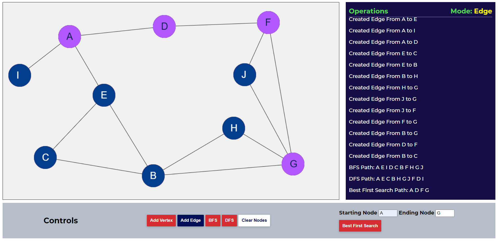

# How to Use

1. Click on `Add Vertex` Button.
2. This will allow you to draw nodes on the canvas by clicking on it.
3. To create an edge between 2 nodes click on the `Add Edge` Button.
4. Now drag the mouse from one node and drop it onto the other node.
5. After creating all the nodes and edges you can click on the `BFS` or `DFS` button to see the breadth first search traversal or depth first search traversal respectively.
6. To get the path between two nodes specify the starting and ending nodes and click on the `Best First Search` button or `A* Search Button`.

